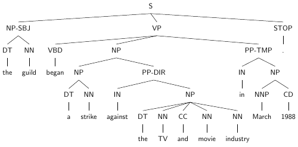

# Day 4: Syntax and Parsing

Carry out all the exercises below and submit your answers
[on Moodle](https://moodle.helsinki.fi/course/view.php?id=33565#section-4).
Also submit a single Python file containing your full
implementation.


## Section 1: CFGs with NLTK

### Exercise 1: Basic CFG use

NLTK contains a method for loading a CFG from a string.
Here, for example, is the small CFG given in the lecture,
specified in the format NLTK can load.

````python
cfg_rules = """
S -> NP VP
NP -> Det N | PropN
Det -> PosPro | Art
VP -> Vt NP

Art -> 'the' | 'a'
PropN -> 'Alice'
N -> 'duck' | 'telescope' | 'park'
Vt -> 'saw'
PosPro -> 'my' | 'her'
"""
cfg = nltk.CFG.fromstring(cfg_rules)
````

This grammar is almost in Chomsky Normal Form.
The only respect in which it diverges is that it
contains 'unary' rules, like 'NP -> PropN'.
The version of CKY shown in the lecture permits
these and NLTK's `is_flexible_chomsky_normal_form()`
method does too.

````python
print(small_cfg.is_flexible_chomsky_normal_form())
````




 * Look at the two example trees above, taken from the Penn Treebank.
   Write a CFG using the above format that produces
   these tree analyses for these two sentences.
   (The grammar does not yet need to be in CNF.)
 * **Submit your CFG rules in text form**


### Exercise 2: Extending the grammar

The NLTK CFG type has a method to check that
all the words of the input sentence are covered
by lexical rules in the grammar. Check now that
you've got lexical rules in your grammar for the
two example sentences.

````python
# Check that all the words of the input sentence are covered
sentences = [
    "the purchase price includes two ancillary companies .".split(),
    "the guild began a strike against the TV and movie industry in March 1988 .".split(),
]
for s in sentences:
    grammar.check_coverage(s)
````


 * Add some more rules to your grammar so that it can
   also generate the sentence:

   *"the guild bought one ancillary company ."*
 * Check that the new, extended grammar can be loaded
   and that it covers the new sentence as well as the old
   ones.
 * **Submit the additional rules you needed to add**


### Exercise 3: Converting to CNF

So far, we've only run sanity checks that the words
of sentences are covered by the grammar. We haven't
yet used the grammar to parse the sentences.
NLTK includes implementations of a number of different
parsing algorithms, including the bottom-up chart parsing
algorithm introduced in the lecture (*CKY*).

The example trees include nodes with more than two
children (e.g. the NP covering *"the TV and movie
industry"*). This causes problems for the parsing
algorithm, but any CFG can be converted to
**Chomsky normal form** (CNF) without
changing the sentences it generates.

For example, a rule
````
A -> B C D
````
can be replaced by
````
A -> B2 D
B2 -> B C
````
where `B2` is a new non-terminal.

 * Convert your grammar above into "flexible" CNF
   (i.e. CNF, but allowing unary rules), load it and
   verify that it's correct using
   `cfg.is_flexible_chomsky_normal_form()`.
 * **Submit the full grammar in text form.**


### Exercise 4: Parsing with the grammar

Load a bottom-up chart parser and initialize it with
your CNF grammar:

````python
from nltk.parse.chart import BottomUpChartParser
parser = BottomUpChartParser(cnf_grammar)
parses = list(parser.parse(sentence))
````

The results are tree structures.

If your grammar is correct, you should get at least
one full parse for each of the example sentences in
exercises 1 and 2, repeated here:

````
the purchase price includes two ancillary companies .
the guild began a strike against the TV and movie industry in March 1988 .
the guild bought one ancillary company .
````

Confirm that the trees produced by the parser match
the two example trees (with the exception of the
additional nodes added in normalization of the grammar).

(You can use the method `parse.draw()` to display the
parse result graphically.)

 * Do you get multiple full parses for any of your
   sentences?
 * Do any of these capture "real" ambiguity
   that distinguishes different interpretations of the
   sentence?
 * **Submit your answers**


## Section 2: Treebank parser


### Exercise 5: Treebank grammar

NLTK provides easy access to a 10% sample of the Penn
Treebank. The full treebank is not available without a
license, but this sample is enough for us to build a
treebank grammar from.

Start by loading the treebank as follows and taking a
look at a couple of its parse trees, which are instances
of NLTK's [Tree](https://www.nltk.org/api/nltk.html#nltk.tree.Tree)
class:

````python
from nltk.corpus import treebank
print(treebank.parsed_sents()[0])
print(treebank.parsed_sents()[1])
````

Or, graphically:

````python
treebank.parsed_sents()[0].draw()
````
The trees in the corpus are represented using NLTK's own data structures,
including:
 * [Nonterminal](https://www.nltk.org/api/nltk.html#nltk.grammar.Nonterminal): represents non-terminal nodes in the tree
 * [Production](https://www.nltk.org/api/nltk.html#nltk.grammar.Production): represents productions/expansions of the form A->B C (etc.)

The same data structures (classes) are used the represents NTs and
productions in the grammars you created above. When you called
`CFG.fromstring()`, the result was a
[CFG](https://www.nltk.org/api/nltk.html#nltk.grammar.CFG) object,
which contained `Nonterminal`s, `Production`s and strings defining
the CFG (see lectures).

The complete set of productions used in a parse tree is directly
available through its `tree.productions()` method.

Given a set of productions using these NLTK data structures,
you can directly build a CFG as follows:
````python
cfg = nltk.CFG(nltk.Nonterminal("S"), productions)
````

This defines the `S` non-terminal as the start symbol of
the grammar. The set of non-terminals and terminals will be all
of those used in the list of productions.

Build a treebank grammar from all the trees in this sample
of the corpus.

Use your grammar as you did in exercise 4 to parse the following
sentences.

````
Mr. Vinken is chairman .
Stocks rose .
Alan introduced a plan .
````

 * How many parse trees does the parser find
   for each sentence?
 * What problems do you see with this parsing
   process?
 * **Submit your answers to these questions**


### Exercise 6: Probabilities

You will have noticed that your treebank parser produced
a huge number of parse trees for even very short sentences.
Most of these are highly implausible, resulting either from
*overgeneration* by the grammar or from a high level of *local
ambiguity* that could be reasonably well ruled out once the
rest of the sentence is taken into account.

In practice, exhaustive parsing of long sentences becomes
completely impractical.

We will now use the treebank to create a PCFG, learning
the grammar from the corpus, as above, and estimating the
probabilities associated with productions from the same data.

Begin by collecting counts of the many expansions of an `S`
non-terminal and using these to estimate a probability
distribution for `S -> ?` rules.

 * Show the counts from which you estimate the probabilities
   and the probabilities of the expansions.
 * Exclude from
   your output any expansions that only occur fewer than 5
   times. (But don't exclude them from the probability
   calculations.)
 * **Submit the list of productions with probabilities
   and the counts needed to estimate them.**


### Exercise 7: PCFG
NLTK provides a tool to estimate all the probabilities of
a PCFG from the productions in a treebank.

````python
from nltk import induce_pcfg
pcfg = induce_pcfg(Nonterminal("S"), productions)
````

The probabilities are computed in the same way you did
in the previous exercise.

NLTK's `InsideChartParser` provides a probabilistic version
of the chart parsing algorithm you used above. It has
a `beam_size` parameter, allowing you to perform
beam search to speed up parsing.

Try parsing the example sentences above, this time with
the PCFG. Experiment with the `beam_size` parameter.

The first parse is now that favoured by the statistical
model and should therefore look much more reasonable than
a randomly chosen example from the exhaustive parse.
Take a look at the top parse(s) and see what you think.

 * What happens if the beam size is too low?
 * Or too high?
 * Do the top parses look better? Are they perfect?
 * **Submit your answers**


### Exercise 8: Out-of-domain parsing

Now we'll try parsing some data that wasn't in the training
corpus. Your parser can only process sentences made up of
words it has seen before, since it has no mechanism for
guessing what rules to use for unseen words. It will for
the same reason struggle to handle grammatical constructions
that differ from those in the training corpus.

Try feeding some sentences into the PCFG parser, as in ex 5,
to see if you can find any full parses.
You could try coming up with sentences yourself, or taking
them from some other source, like news articles.

They will need to be tokenized
in the same style as the Penn Treebank. You can either do that
manually or use NLTK's `TreebankWordTokenizer`, which
produces PTB-style tokenization.

 * Did you find any parsable sentences?
 * How might you extend your parser to increase its coverage, so
   that it can parse more sentences?
 * **Submit any parsable sentences you managed to find
   and a short description of your ideas to extend coverage**
